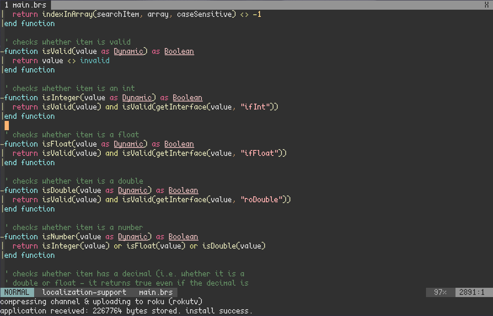

### roku.vim
a vim plugin for roku development - provides brightscript language support (syntax highlighting, folding, section movement, indentation, etc) as well as channel installation/packaging from within vim.

